# Oluen pano blogi postaus

Tein kaljaa :D

## Resepti

S.M.a.S.H Columbus-IPA

Maltaat:
- 2kg Crisp clear choice 

Humalat:
- 50g Columbus pelletit

Hiiva:
- Safale S-33

Mäskäys 60min @ 67c

Keitto 60min

## Mäskäys

Mäskäys aloitettiin lämmittämällä 5l vettä noin 75-asteiseksi.

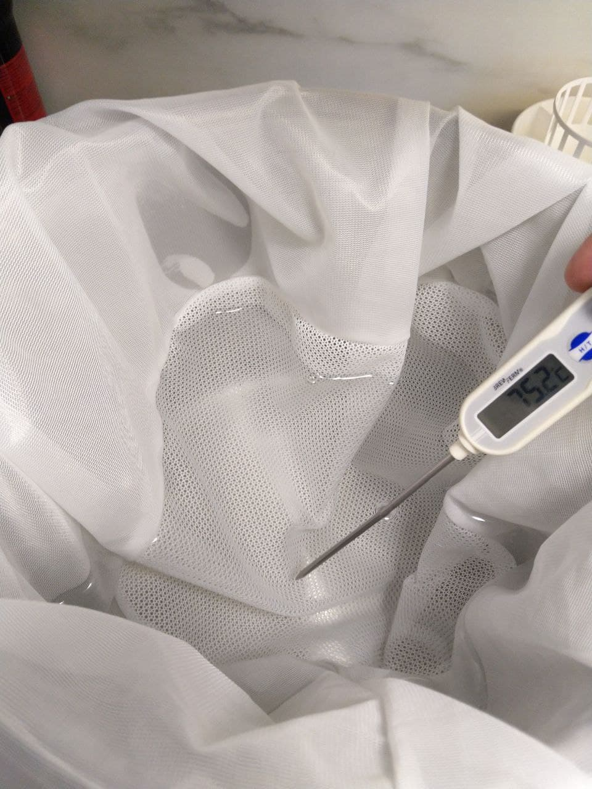

Tämän jälkeen lisättiin maltaat keitokseen välillä sekoittaen. Samalla esilämmitettiin uuni noin 75-asteeseen.

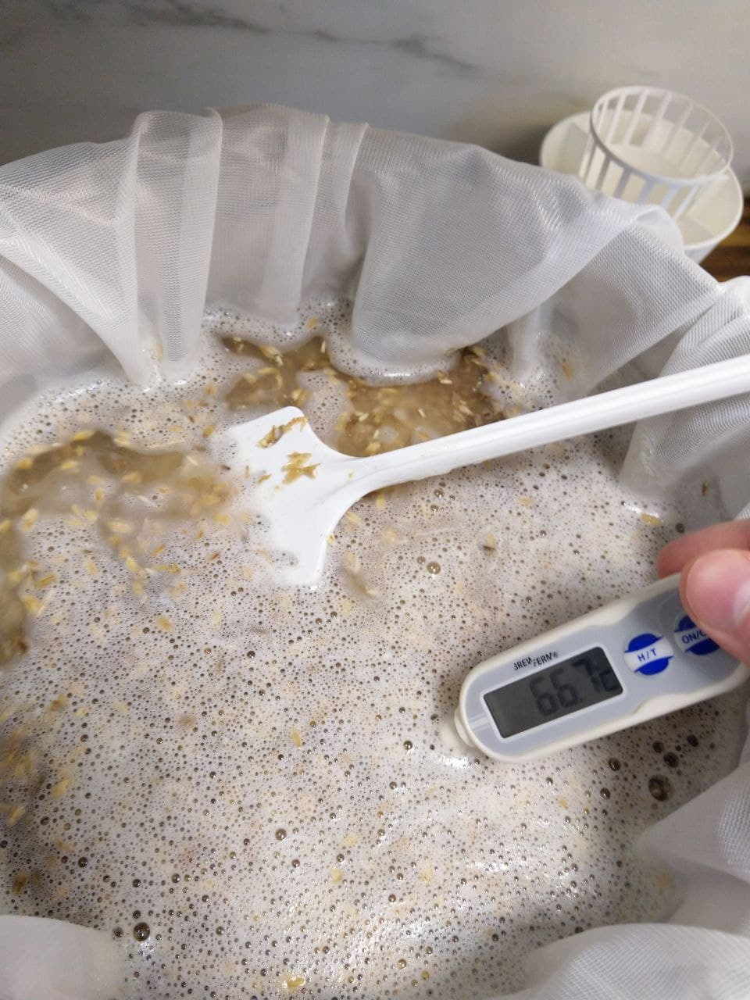

Seoksen lopulliseksi lämpötilaksi tuli noin 66c.

Digitaalinen lämpömittari sisään ja koko kattila uuniin tunniksi. Uuni on tässä vaiheessa jo kytketty pois päältä.

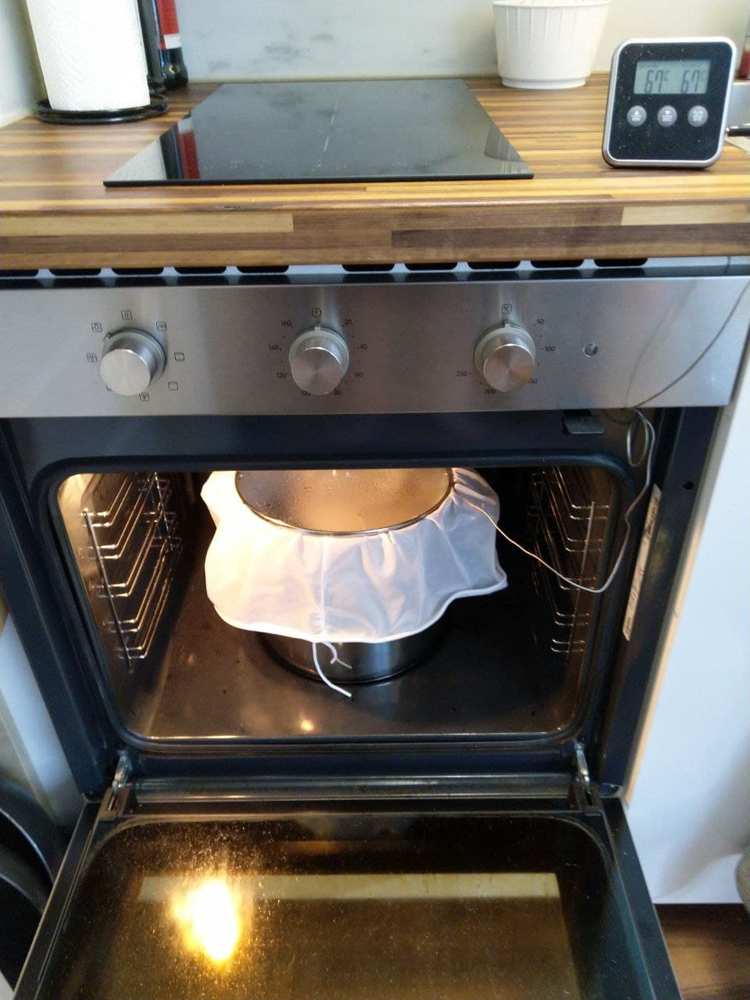

10min ennen uunista poistamista lämmitettiin 4l huuhteluvettä 75-asteiseksi. Tähän käytettiin kattilaa sekä vedenkeitintä

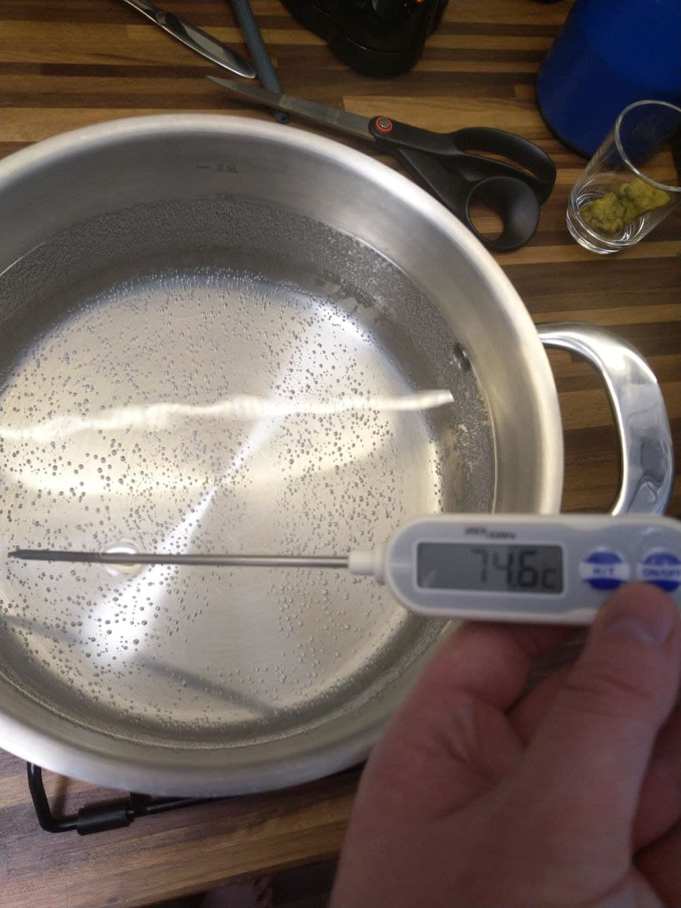

Mäski nostettiin uunista ja mäskäyspussi nostettiin lävikön päälle

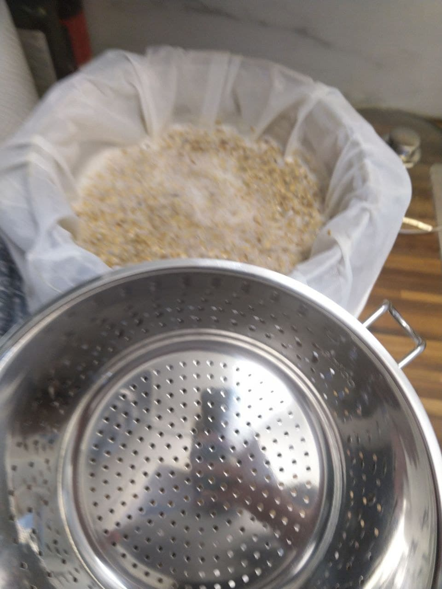
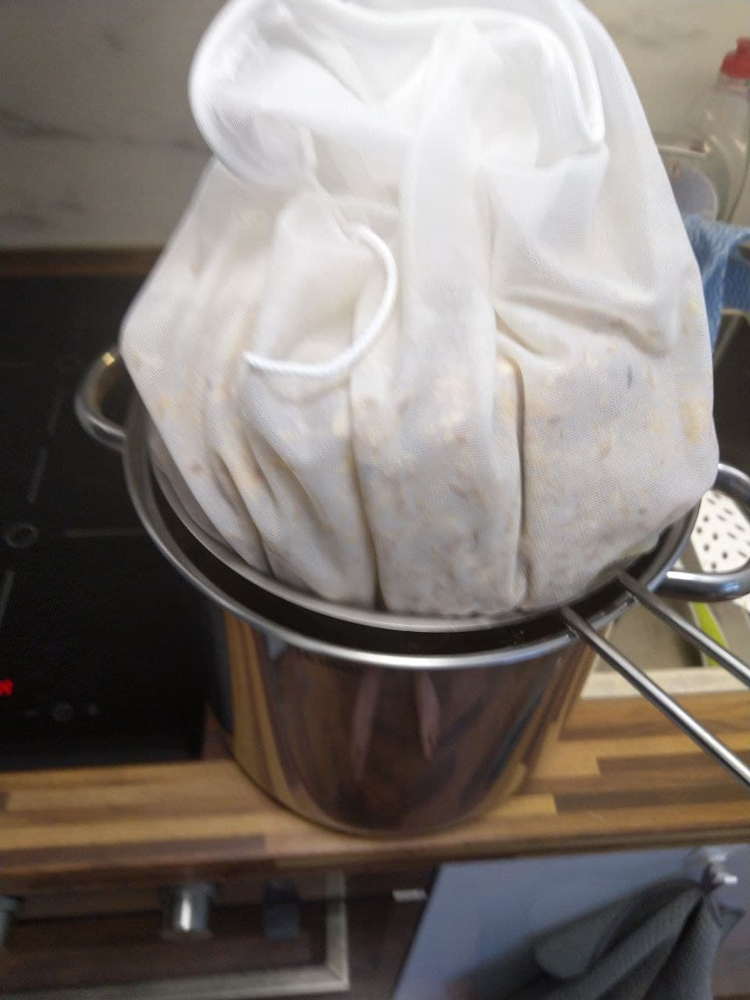

Tämän jälkeen mäskiä huudeltiin lävikössä ja puristeltiin kuivaksi

Lopputuloksena oli noin 8 litraa herkullista sokerivettä

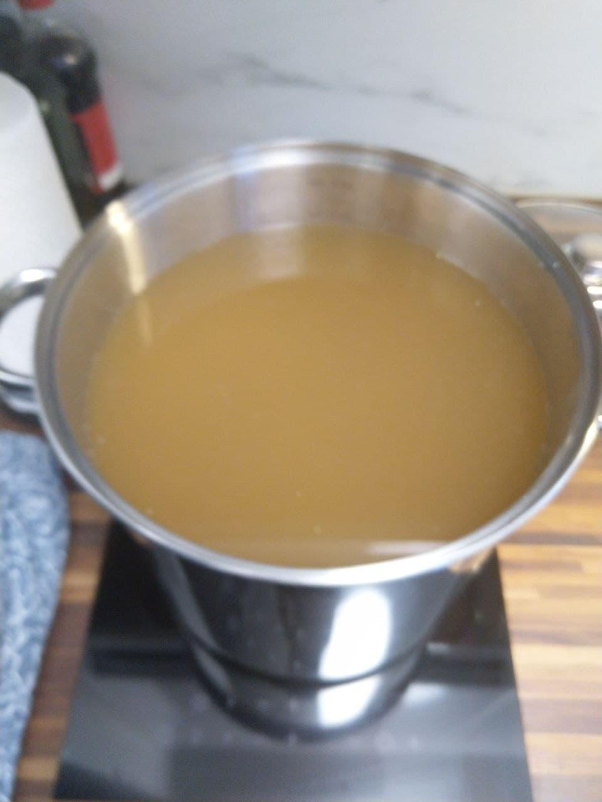

## Keitto

IKEAN induktioliesi laitettiin koetukselle ja lähdettiin lämmittämään seosta kiehuvaksi.

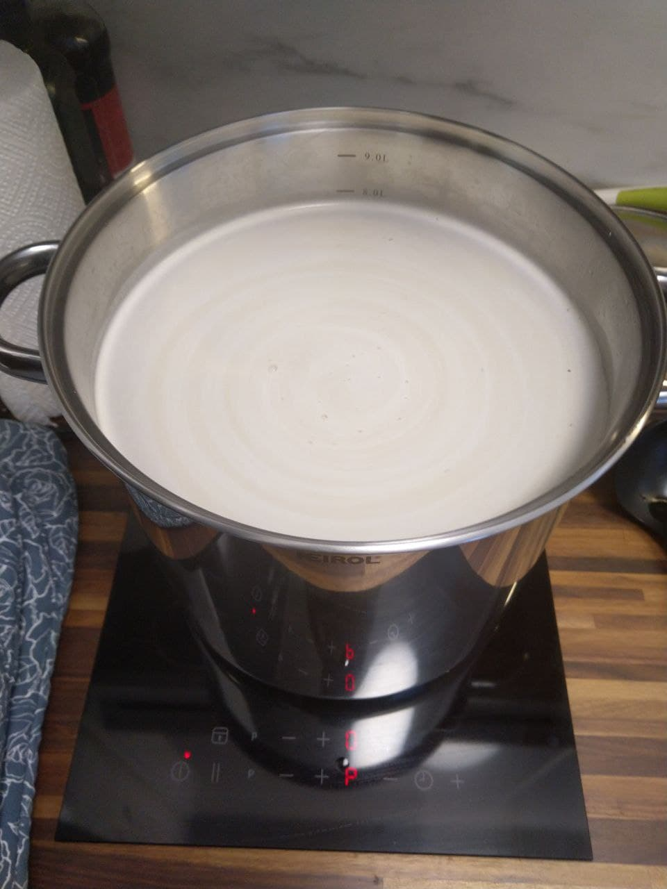

Kun kiehumispiste saavutettiin, lisättiin humalat sekaan humalapussissa. Humalapussi jätettiin osittain auki, jotta voitiin lisätä humalaa keiton eri vaiheissa käyttämättä useaa humalapussia.

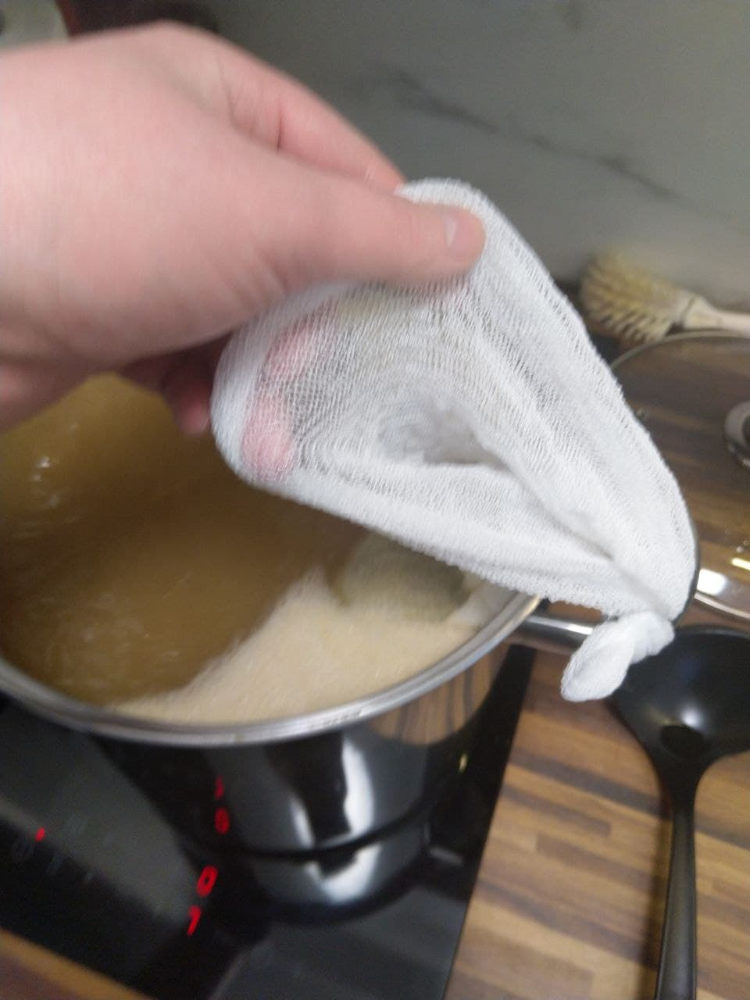

Humala-aikataulu:
| Tables        | Are           |
| ------------- |:-------------:|
| 60min    | 10g Columbus |
| 30min    | 10g Columbus |
| 15min    | 15g Columbus |
| 0min/Whirlpool    | 10g Columbus |
| Dry hop   | 15g Columbus |

60min keiton jälkeen pyöräytettiin sekoittimella pieni pyörre, jossa viimeisimmät humalat olivat mukana. Tämän jälkeen kattila siirrettiin pois levyltä ja jäähdytyskäämi asennettiin paikalleen.

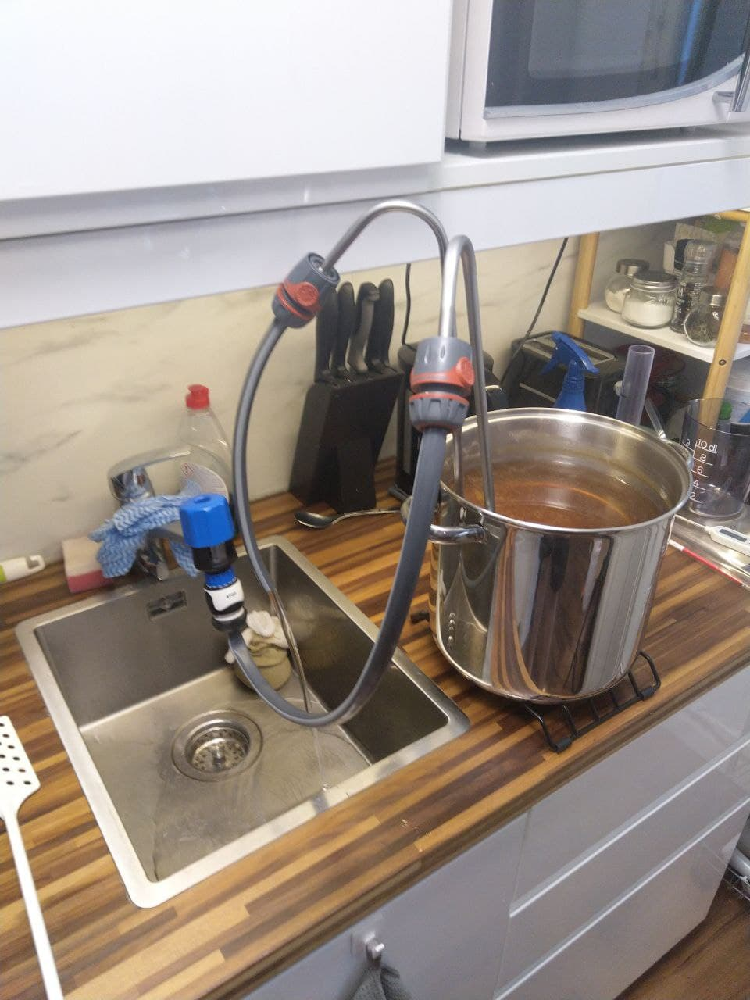

Vierre jäähdytettiin noin 20-asteiseksi.

## Käyminen

Jäähtynyt vierre kaadettiin desinfioituun käymisastiaan siivilän läpi.

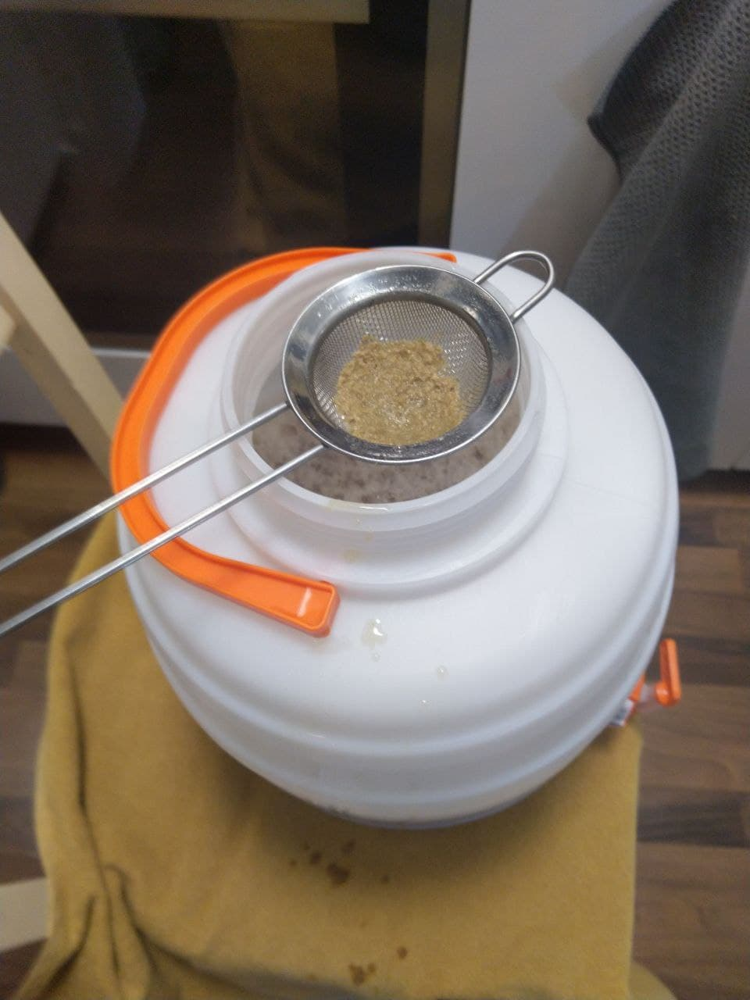

Käymisastian kansi suljettiin ja vierrettä hölskyteltiin, jotta vierre ilmaantuisi. Kuivahiiva lisättiin käymisastiaan sellaisenaan.

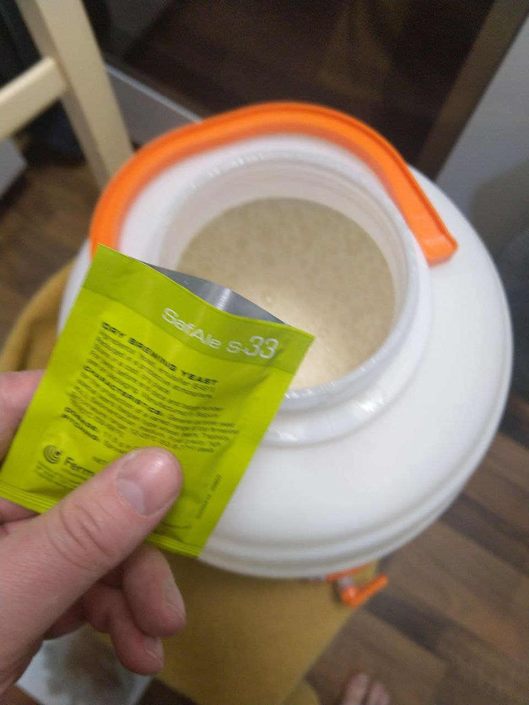

Vierteen ominaispaino (OG): 1,058

Tavoite ominaispaino (FG): 1,016

Laskettu mäskäyksen tehokkuus 2kg maltaasta: 65%

Arvioitu alkoholin tilavuusprosenntti: 5,42%
